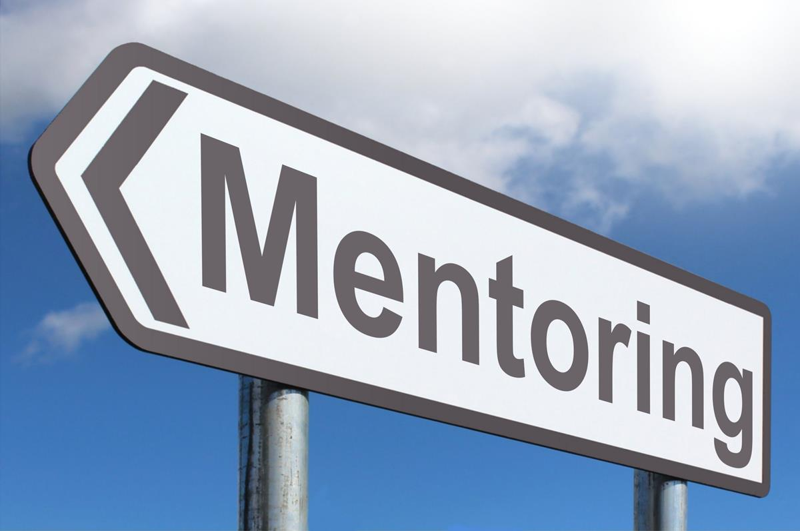
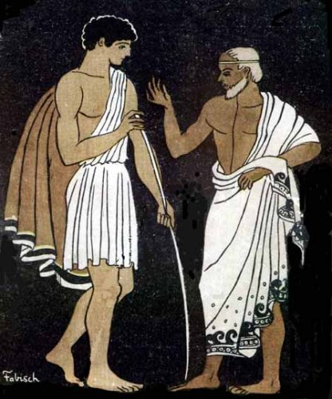
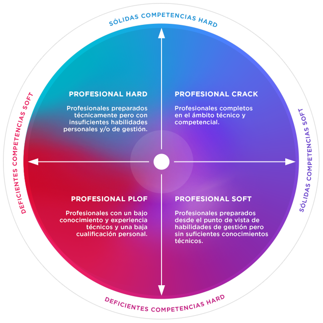
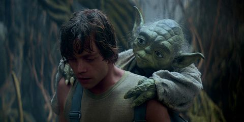
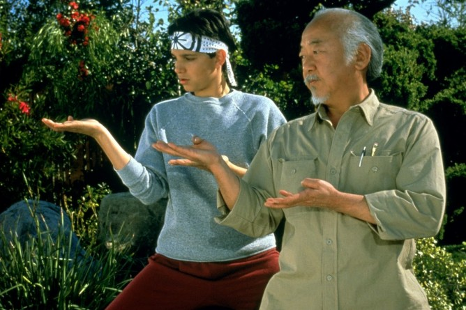
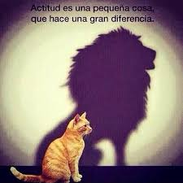
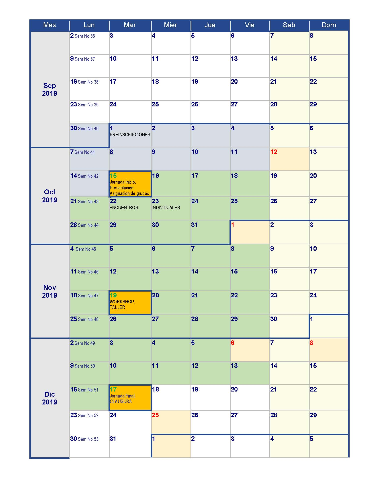

layout: true
background-image: url(imag/logoCCMurcia.png)
background-position: 100% 0% 
background-size: 12%

```{r setup, include=FALSE}
#<div class="my-footer"><span>www.enRdados.net</span></div> 
options(htmltools.dir.version = FALSE)
library("xaringan")

# https://yihui.name/en/2017/08/why-xaringan-remark-js/
# para verolo en directo
#  xaringan::inf_mr()

#https://yihui.name/en/2019/02/ultimate-inf-mr/
# https://slides.yihui.name/xaringan/#8

# https://yihui.name/en/2017/08/why-xaringan-remark-js/

# para guardar la presentacion como pdf
# necesito el paquete pagedown y chrome instalado en el PC
# pagedown::chrome_print("C:/R/proyectos/mentoring/pMentoring3.html")
```


---

# ¿Qué es el mentoring?

 `r icon::fa('arrow-alt-circle-right')` El **mentoring** es un proceso de desarrollo personal y profesional en el que una persona con más experiencia y conocimientos ayuda a otras que no disponen de esa experiencia ni conocimientos.

 `r icon::fa('arrow-alt-circle-right')` Es un servicio de apoyo, basado en la *escucha*, el *diálogo*,la *orientación* y *compartir experiencias*.


```{r echo=FALSE, out.width = "600px", out.height="200px",fig.align='center'}

```

---

# El Origen

Todo viene de *"La Odisea”* de *Homero*

* Ulises (*Odiseo en griego*) parte a la batalla de **Troya**, en la que sería vencedor. 
  Antes de marchar dejó a su hijo **Telémaco** a cargo de un gran amigo **Méntor**.
  
* En realidad **Méntor** es la diosa *Atenea* que guía, conduce y aconseja a *Telémaco*, para que desarrolle y potencie sus habilidades, su talento.
  
* **Méntor** no inculca, no da clases magistrales; emplea el diálogo para que el discípulo aprenda por sí mismo, y de este modo, llegue a convertirse en un líder eficaz y en un hombre que piensa en libertad.  

```{r echo=FALSE,fig.align='center', out.width = "200px", out.height="200px"}

```
---

class: inverse, center, middle

# y ahora ¿ qué ?

```{r echo=FALSE, fig.align='center', out.width = "600px", out.height="400px"}

```

--

El mentoring es la `r icon::fa('key')` para abrir muchas `r icon::fa('door-open')`

---

# Objetivos del programa

El **mentoring** es una metodología complementaria de aprendizaje basada en la experiencia que:

- Favorece la transmisión de valores además de conocimiento `r icon::fa('people-carry')`
- Agiliza la adquisición de experiencia `r icon::fa('user-graduate')`
- Crea vínculos personales, profesionales y de colectivo.`r icon::fa('handshake')`
- Motiva, mejora la confianza y refuerza la iniciativa personal. `r icon::fa('award')`

```{r echo=FALSE, out.width = "500px", out.height="250px",fig.align='center'}

```
---

class: inverse

# Objetivos del programa II

* Actuar sobre vuestras habilidades blandas 

* La carreta te aporta conocimientos técnicos, pero no otras habilidades muy necesarias para la carrera profesional

```{r echo=FALSE, fig.align='center', out.width = "600px", out.height="400px"}

```


---
class: inverse

# ¿Quíenes intervienen?

.pull-left[

# Mentor

- Facilita el desarrollo del **pupilo**, a través del intercambio de sus propios recursos, conocimientos, valores, habilidades, perspectivas, actitudes y competencias.

- Le ofrece la oportunidad de desarrollar nuevas perspectivas, *hacerse preguntas*, conocer otras inquietudes y ampliar su visión  personal y profesional.


]

.pull-right[
# Pupilo

- El **pupilo** desarrollará habilidades y conocimientos que le ayudarán a alcanzar las metas que *él mismo defina*.

```{r echo=FALSE, out.width = "500px", out.height="200px"}

```
]

---
# Habilidades requeridas
.pull-left[
# Mentor
- Escucha activa
- Construcción gradual de confianza
- Definición de objetivos y desarrollo de capacidades
- Dar soporte e inspiración
- Ser ejemplo

```{r echo=FALSE, out.width = "500px", out.height="200px"}

```

]
.pull-right[
# Pupilo
- Escucha activa
- Voluntad de aprendizaje
- Construcción gradual de confianza
- Definir objetivos
- Valentía, coraje


```{r echo=FALSE, fig.align='center', out.width = "200px", out.height="200px"}

```

]
---

# Etapas de un programa mentoring

 Lo primero es tener un entorno de desarrollo favorable dentro de la empresa, colegio profesional...después:

`r icon::fa('thumbs-up')` **Construcción de la relación entre mentor y pupillo** 

`r icon::fa('thumbs-up')` **Intercambio de información y fijación de metas**

`r icon::fa('thumbs-up')` **Definir trabajos y acciones para lograr los objetivos**

`r icon::fa('thumbs-up')` **Fin del programa mentoring y planificación de futuro**

```{r echo=FALSE, fig.align='center',out.width = "700px", out.height="200px"}

# iconos aquíu:
#https://fontawesome.com/icons?d=gallery
```

---

# Desarrollo del I programa mentór CICCP Murcia

- Análisis de los perfiles y emparejamientos

--

- 2 jornadas con talleres grupales

--

- 2 meses de relaciones mentor y pupilo (la meta es tener al menos 5 encuentros con el mentor durante el programa de 9 semanas)

- Seguimiento continuo por parte del coordinador

--

- Clausura y exposición final.

---

background-image: url(imag/fondo6.jpg)
background-size: cover

# Jornadas comunes

.pull-left[
### Taller I
- Desarrollo de marca personal

### Taller II
- Experiencias vitales.

### Clausura  
- Exposición de trabajo fin de programa.
- Coloquio de cierre de programa
]

.pull-right[

```{r echo=FALSE, out.width = "500px", out.height="400px"}


```
]

---

class: inverse, center, middle

# Si tienes talento, no lo uses para llegar más lejos, úsalo para llegar más acompañado

Muchas Gracias!!

`r icon::fa('paper-plane')`